# GRW

Graph construction, mutation, and morphism matching in Rust.

GRW is an embedded graph rewriting system that runs inside a Rust process. The user API is modelled as small domain-specific languages built with `macro_rules!` — no procedural macros — by overloading Rust operators to express graph edge semantics. All DSL fragments are plain Rust structs — they can be constructed, composed, and manipulated programmatically before being passed to the macros or the underlying `from_fragment()` / `modify()` / `compile()` functions directly.

- [**`graph!`**](#graph--construction) — graph literal (like `vec!`)
- [**`modify!`**](#modify--mutation) — transactional graph mutation (add/remove/change nodes and edges atomically)
- [**`search!`**](#search--pattern-matching) — graph pattern matching iterator with morphism control

## Graph model

A graph `Graph<NV, ER>` is parameterized by:
- `NV` — node value type (use `()` for no attributes)
- `ER` — edge relation type, one of:

| Edge type | Operators | Max edges between 2 nodes | Slots |
|-----------|-----------|---------------------------|-------|
| `edge::Undir<EV>` | `^` | 1 undirected | `UND` |
| `edge::Dir<EV>` | `>>` `<<` | 2 directed (incoming + outgoing) | `SRC` `TGT` |
| `edge::Anydir<EV>` | `^` `>>` `<<` | 3 (undirected + incoming + outgoing) | `UND` `SRC` `TGT` |

Type aliases for common configurations:

```rust
type Undir0      = Graph<(), edge::Undir<()>>;      // no attributes
type UndirN<NV>  = Graph<NV, edge::Undir<()>>;      // node values only
type UndirE<EV>  = Graph<(), edge::Undir<EV>>;      // edge values only
type Undir<N, E> = Graph<NV, edge::Undir<EV>>;      // both

type Dir0         = Graph<(), edge::Dir<()>>;
type Anydir0      = Graph<(), edge::Anydir<()>>;
// ... same pattern for Dir, Anydir
```

---

<h2><code>graph!</code> — construction</h2>

<details open><summary><b>DSL primitives</b></summary>

| Symbol | Meaning |
|--------|---------|
| `N(id)` | New node with explicit local id |
| `N_()` | New node with auto-assigned id |
| `n(id)` | Reference to previously defined node |
| `E()` | Edge constructor (for attaching values) |
| `.val(v)` | Attach a value to a node or edge |
| `^` | Undirected edge |
| `>>` | Directed edge (source → target) |
| `<<` | Directed edge (target ← source) |
| `&` | Attach explicit edge before direction operator |
| `,` | Separate independent fragments |

</details>

<details open><summary><b>Undirected graphs</b></summary>

<table width="100%">
<tr><td width="65%" valign="top">

```rust
use grw::graph::{self, Graph, edge};

// path: 0 — 1 — 2  (grouping builds a chain)
let g: Graph<(), edge::Undir<()>> = graph![
    N(0) ^ (N(1) ^ N(2))
].unwrap();
```

</td><td width="35%" align="center" valign="middle">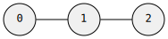</td></tr>
<tr><td width="65%" valign="top">

```rust
// triangle: chain + back-reference closes the cycle
let g: Graph<(), edge::Undir<()>> = graph![
    N(0) ^ (N(1) ^ (N(2) ^ n(0)))
].unwrap();
```

</td><td width="35%" align="center" valign="middle"></td></tr>
<tr><td width="65%" valign="top">

```rust
// star: flat chaining fans out from one node
let g: Graph<(), edge::Undir<()>> = graph![
    N(0) ^ N(1)
         ^ N(2)
         ^ N(3)
         ^ N(4)
].unwrap();
```

</td><td width="35%" align="center" valign="middle">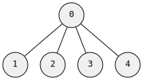</td></tr>
</table>

```rust
// with node values
let g: Graph<&str, edge::Undir<()>> = graph![
    N(0).val("alice") ^ (N(1).val("bob") ^ N(2).val("carol"))
].unwrap();

// with edge values — use & E().val(...) before the direction operator
let g: Graph<(), edge::Undir<f64>> = graph![
    N(0) & E().val(1.5) ^ (N(1) & E().val(2.0) ^ N(2))
].unwrap();

// both node and edge values
let g: Graph<&str, edge::Undir<u32>> = graph![
    N(0).val("a") & E().val(10) ^ N(1).val("b")
].unwrap();

// anonymous nodes — ids assigned automatically
let g: Graph<(), edge::Undir<()>> = graph![N_() ^ N_() ^ N_()].unwrap();
```

</details>

<details open><summary><b>Directed graphs</b></summary>

<table width="100%">
<tr><td width="65%" valign="top">

```rust
// path: 0 → 1 → 2  (grouping builds a chain)
let g: Graph<(), edge::Dir<()>> = graph![
    N(0) >> (N(1) >> N(2))
].unwrap();
```

</td><td width="35%" align="center" valign="middle">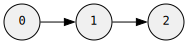</td></tr>
<tr><td width="65%" valign="top">

```rust
// fan-out: flat chaining from one node
let g: Graph<(), edge::Dir<()>> = graph![
    N(0) >> N(1)
         >> N(2)
         >> N(3)
].unwrap();
```

</td><td width="35%" align="center" valign="middle">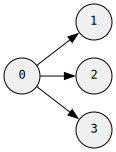</td></tr>
<tr><td width="65%" valign="top">

```rust
// bidirectional: n() references existing nodes
let g: Graph<(), edge::Dir<()>> = graph![
    N(0) >> N(1),
    n(1) >> n(0),
].unwrap();
```

</td><td width="35%" align="center" valign="middle">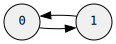</td></tr>
</table>

```rust
// incoming edges with <<
let g: Graph<(), edge::Dir<()>> = graph![
    N(0) << N(1),   // edge from 1 to 0
].unwrap();

// directed with edge values
let g: Graph<(), edge::Dir<i32>> = graph![
    N(0) & E().val(10) >> (N(1) & E().val(20) >> N(2))
].unwrap();
```

</details>

<details open><summary><b>Anydirected graphs (mixed undirected + directed)</b></summary>

<table width="100%">
<tr><td width="65%" valign="top">

```rust
// mix all edge types in one graph
let g: Graph<(), edge::Anydir<()>> = graph![
    N(0) ^ (N(1) >> N(2)),  // 0 — 1 → 2
    N(3) << n(2),            // 2 → 3
].unwrap();
```

</td><td width="35%" align="center" valign="middle">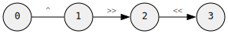</td></tr>
<tr><td width="65%" valign="top">

```rust
// all three edge types between one pair
let g: Graph<(), edge::Anydir<()>> = graph![
    N(0) ^ N(1),         // undirected
    n(0) >> n(1),        // directed 0 → 1
    n(1) >> n(0),        // directed 1 → 0
].unwrap();
```

</td><td width="35%" align="center" valign="middle">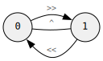</td></tr>
</table>

</details>

<details><summary><b>Turbofish syntax</b></summary>

When the type can't be inferred, use the turbofish form:

```rust
let g = graph![<(), grw::graph::edge::Undir<()>>; N(0) ^ N(1)].unwrap();
```

</details>

---

<h2><code>modify!</code> — mutation</h2>

`modify!` applies transactional changes to an existing graph — adding nodes, removing nodes, adding/removing edges, and swapping values — all atomically. It returns a `Modification` with the ids of everything that changed.

<details open><summary><b>DSL primitives</b></summary>

| Symbol | Meaning |
|--------|---------|
| `N(id)` | New node (local id for back-references within this modification) |
| `N_()` | New node (auto-assigned local id) |
| `n(id)` | Reference to new node defined earlier in same `modify!` |
| `X(id)` | Existing graph node (by graph node id) |
| `x(id)` | Reference to existing graph node (no value change) |
| `!X(id)` | Remove existing node (and all its edges) |
| `E()` | New edge constructor |
| `e()` | Existing edge reference (for value swap) |
| `!e()` | Remove existing edge |
| `.val(v)` | Set value on node or edge |

</details>

<details open><summary><b>Adding nodes and edges</b></summary>

<table width="100%">
<tr><td width="65%" valign="top">

```rust
use grw::graph::{self, Graph, edge};

let mut g: Graph<(), edge::Undir<()>> = Graph::default();

// add two connected nodes
modify!(g, [N(1) ^ N(2)]).unwrap();
assert_eq!(g.node_count(), 2);
assert_eq!(g.edge_count(), 1);
```

</td><td width="35%" align="center" valign="middle">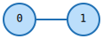</td></tr>
<tr><td width="65%" valign="top">

```rust
// connect new node to existing
modify!(g, [X(0) ^ N(3)]).unwrap();
assert_eq!(g.node_count(), 3);
assert_eq!(g.edge_count(), 2);
```

</td><td width="35%" align="center" valign="middle">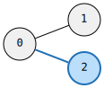</td></tr>
<tr><td width="65%" valign="top">

```rust
let mut g: Graph<(), edge::Dir<()>> = Graph::default();

// directed path
modify!(g, [N(1) >> (N(2) >> N(3))]).unwrap();
assert_eq!(g.node_count(), 3);
assert_eq!(g.edge_count(), 2);
```

</td><td width="35%" align="center" valign="middle">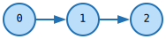</td></tr>
<tr><td width="65%" valign="top">

```rust
let mut g: Graph<(), edge::Undir<()>> = Graph::default();

// triangle via back-reference
modify!(g, [N(1) ^ (N(2) ^ (N(3) ^ n(1)))]).unwrap();
assert_eq!(g.node_count(), 3);
assert_eq!(g.edge_count(), 3);
```

</td><td width="35%" align="center" valign="middle">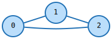</td></tr>
<tr><td width="65%" valign="top">

```rust
let mut g: Graph<&str, edge::Undir<u32>> = Graph::default();

// node and edge values
modify!(g, [
    N(1).val("a") & E().val(42u32) ^ N(2).val("b")
]).unwrap();
assert_eq!(g.node_count(), 2);
assert_eq!(g.edge_count(), 1);
```

</td><td width="35%" align="center" valign="middle">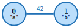</td></tr>
<tr><td width="65%" valign="top">

```rust
// isolated node
modify!(g, [N(3).val("c")]).unwrap();
assert_eq!(g.node_count(), 3);
```

</td><td width="35%" align="center" valign="middle">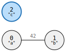</td></tr>
</table>

</details>

<details open><summary><b>Removing nodes and edges</b></summary>

<table width="100%">
<tr><td width="65%" valign="top">

```rust
let mut g: Graph<(), edge::Undir<()>> = Graph::default();
modify!(g, [N(1) ^ N(2) ^ N(3)]).unwrap();

// remove node 1 (and its edges to 0, 2)
modify!(g, [!X(1)]).unwrap();
assert_eq!(g.node_count(), 2);
```

</td><td width="35%" align="center" valign="middle">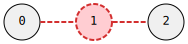</td></tr>
<tr><td width="65%" valign="top">

```rust
let mut g: Graph<(), edge::Dir<()>> = Graph::default();
modify!(g, [N(1) >> N(2)]).unwrap();

// remove edge, keep both nodes
modify!(g, [X(0) & !e() >> x(1)]).unwrap();
assert_eq!(g.node_count(), 2);
assert_eq!(g.edge_count(), 0);
```

</td><td width="35%" align="center" valign="middle">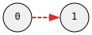</td></tr>
</table>

</details>

<details open><summary><b>Updating values</b></summary>

<table width="100%">
<tr><td width="65%" valign="top">

```rust
let mut g: Graph<&str, edge::Undir<()>> = Graph::default();
modify!(g, [N(1).val("old")]).unwrap();
assert_eq!(g.get(0), Some(&"old"));

// swap node value
modify!(g, [X(0).val("new")]).unwrap();
assert_eq!(g.get(0), Some(&"new"));
```

</td><td width="35%" align="center" valign="middle"></td></tr>
<tr><td width="65%" valign="top">

```rust
let mut g: Graph<(), edge::Undir<u32>> = Graph::default();
modify!(g, [N(1) & E().val(100u32) ^ N(2)]).unwrap();

// swap edge value
modify!(g, [X(0) & e().val(200u32) ^ X(1)]).unwrap();
```

</td><td width="35%" align="center" valign="middle">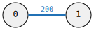</td></tr>
</table>

</details>

<details open><summary><b>Modification result</b></summary>

The returned `Modification` contains:
- `new_node_ids` — mapping from local ids to real graph ids
- `added_edges` — edges created
- `removed_nodes` / `removed_edges` — what was deleted
- `swapped_node_vals` / `swapped_edge_vals` — old values that were replaced

</details>

---

<h2><code>search!</code> — pattern matching</h2>

`search!` compiles a pattern into a query and iterates over all morphism-valid mappings from pattern nodes to target graph nodes. Patterns are organized into **clusters** — `get` (required) and `ban` (forbidden substructures).

<table width="100%">
<tr><td width="50%" align="center">

**Pattern** (what you're looking for)

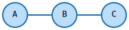

</td><td width="50%" align="center">

**Target** (the graph you're searching in)

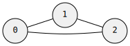

</td></tr>
</table>

<details open><summary><b>DSL primitives</b></summary>

| Symbol | Meaning |
|--------|---------|
| `get(morphism) { ... }` | Required pattern cluster — must be found |
| `ban(morphism) { ... }` | Forbidden pattern cluster — matches are rejected |
| `N(id)` | Pattern node |
| `n(id)` | Reference to pattern node |
| `^` `>>` `<<` | Edge operators (same as `graph!`) |
| `!N(id)` | Negated node — the edge must NOT exist |
| `N(id).val(v)` | Node value — exact match |
| `N(id).test(\|v\| ...)` | Node value predicate |
| `E().val(v)` | Edge value — exact match |
| `X(id)` | Context node — pinned to a specific graph node |

</details>

<details open><summary><b>Basic usage</b></summary>

When `search!` receives a graph reference, it creates a `Session` that you iterate directly with a `for` loop:

```rust
use grw::*;           // Graph, graph!, search!, Morphism, etc.
use grw::graph::edge;

// target graph: triangle 0—1—2—0
let g: graph::Undir0 = graph![
    N(0) ^ (N(1) ^ (N(2) ^ n(0)))
].unwrap();

// search! with a graph reference → Session → for loop
let session = search![&g,
    get(Mono) {
        N(0) ^ N(1)
    }
].unwrap();

for m in &session {
    let a = m.get(0).unwrap();   // graph node matched by pattern node 0
    let b = m.get(1).unwrap();   // graph node matched by pattern node 1
    println!("{:?} — {:?}", a, b);
}
```

</details>

<details open><summary><b>The Match struct</b></summary>

Each iteration yields a `Match` — a mapping from pattern node local ids to graph node ids.

```rust
let session = search![&g, get(Mono) { N(0) ^ N(1) }].unwrap();

for m in &session {
    // get a specific pattern node's graph mapping
    let node_id: id::N = m.get(0).unwrap();

    // iterate all (pattern_local_id, graph_node_id) pairs
    for &(lid, nid) in m.iter() {
        println!("pattern {} → graph {:?}", lid.0, nid);
    }

    // just the graph node ids
    let graph_nodes: Vec<id::N> = m.values().collect();
}
```

For richer access — node values, adjacencies — use `translate()`:

```rust
for m in &session {
    let tm = session.translate(&m);

    // node with its value
    if let Some((nid, val)) = tm.node(0) {
        println!("pattern 0 → graph {:?} val={:?}", nid, val);
    }

    // all matched nodes with values
    for (lid, nid, val) in tm.nodes() {
        println!("{} → {:?} = {:?}", lid.0, nid, val);
    }
}
```

</details>

<details open><summary><b>Ban clusters (forbidden substructures)</b></summary>

```rust
// find edges whose endpoints do NOT share a common neighbor
let session = search![&g,
    get(Mono) {
        N(0) ^ N(1)
    },
    ban(Mono) {
        n(0) ^ N(2),
        n(1) ^ n(2),
    }
].unwrap();
```

</details>

<details open><summary><b>Sequential vs parallel iteration</b></summary>

The `Session` returned by `search![&g, ...]` supports two iteration modes:

```rust
// sequential — lazy iterator, one match at a time (backtracking)
for m in session.iter() { /* ... */ }

// parallel — uses rayon, returns all matches at once
let all_matches: Vec<Match> = session.par_iter().collect();
```

`session.iter()` (or `&session` in a `for` loop) is `Seq` — single-threaded lazy backtracking. `session.par_iter()` is `Par` — partitions the search space across threads via rayon.

</details>

<details><summary><b>Index tiers (optional optimization)</b></summary>

When using `search![&g, ...]`, the graph is indexed automatically with `RevCsr`. For manual control, you can index explicitly and use the lower-level `Seq::search` / `Par::search` API:

| Tier | What it builds | When to use |
|------|---------------|-------------|
| `Rev` | Reverse adjacency map | Minimal memory, small graphs |
| `RevCsr` | CSR-compressed reverse adjacency | Default choice, good balance |
| `RevCsrVal` | CSR + cached edge values | Valued graphs with edge predicates |

```rust
use grw::search::{Search, Seq, Par, RevCsr};

let Search::Resolved(r) = search![<(), edge::Undir<()>>;
    get(Mono) { N(0) ^ N(1) }
].unwrap() else { panic!() };

let indexed = g.index(RevCsr);

// low-level sequential
let matches: Vec<_> = Seq::search(&r.query, &indexed).collect();

// low-level parallel
let matches: Vec<_> = Par::search(&r.query, &indexed);
```

</details>

---

<h2>Morphisms</h2>

A **morphism** is a mapping from pattern nodes to target nodes that preserves edges. Three independent axes control how strict the mapping is:

| Axis | Meaning |
|------|---------|
| **Injective** | One-to-one — no two pattern nodes map to the same target node |
| **Surjective** | Covers everything — every target node is hit by at least one pattern node |
| **Induced** | Exact neighborhood — no extra edges allowed between matched nodes |

<details open><summary><b>The six morphisms</b></summary>

| Morphism | Injective | Surjective | Induced | Plain English |
|----------|-----------|------------|---------|---------------|
| **Iso** | yes | yes | yes | Exact match — same shape, same size, same edges |
| **SubIso** | yes | no | yes | Find this exact shape inside the target |
| **EpiMono** | yes | yes | no | Bijection, but extra edges between matched nodes OK |
| **Mono** | yes | no | no | Each pattern node gets a unique target node, extra edges OK |
| **Epi** | no | yes | no | Must cover all target nodes, can collapse pattern nodes |
| **Homo** | no | no | no | Anything goes — just preserve edges |

</details>

<details open><summary><b>Lattice</b></summary>

These form a partial order. Going up adds constraints, going down relaxes them. The `meet()` of two morphisms is the most relaxed morphism that satisfies both.

```
         Iso
        /   \
    SubIso  EpiMono
       \   / \   /
        Mono   Epi
          \   /
           Homo
```

- Up = more constrained, down = more relaxed
- `SubIso` = Mono + induced, `EpiMono` = Mono + surjective
- `Iso` = SubIso + surjective = EpiMono + induced

</details>

<details><summary><b>When to use what</b></summary>

- **Iso** — "Are these two graphs identical?" Graph comparison, canonical forms, symmetry detection.
- **SubIso** — "Does this shape appear inside that graph?" The workhorse of pattern matching. Find motifs, substructures, embedded patterns. The matched region must look *exactly* like the pattern — no extra connections.
- **Mono** — "Can I embed this pattern without node conflicts?" Like SubIso but relaxed: extra edges between matched nodes are allowed. Often easier to compute.
- **Epi** — "Does the pattern cover the entire target?" Every target node must be matched. Coverage analysis, tiling.
- **EpiMono** — "Is this a relabeling with possible extra edges?" Bijective but non-induced. Arises naturally when combining Mono and Epi constraints.
- **Homo** — "Can this pattern be projected onto that graph?" Most relaxed. Graph coloring is a homomorphism to a complete graph.

</details>

<details open><summary><b>Visual examples</b></summary>

Pattern: path `A — B — C`. Target: triangle `0 — 1 — 2 — 0`.

<table width="100%">
<tr><td width="50%" align="center">

**Pattern**


</td><td width="50%" align="center">

**Target**


</td></tr>
</table>

**Mapping A→0, B→1, C→2** — the required edges (A—B, B—C) are present, but there's an extra edge 0—2 not in the pattern:

<table width="100%">
<tr><td width="50%" align="center">

**Mono: accept**

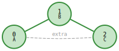

extra edge OK — not induced

</td><td width="50%" align="center">

**SubIso: reject**

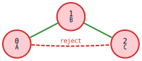

extra edge violates induced constraint

</td></tr>
</table>

| Morphism | Verdict | Why |
|----------|---------|-----|
| **Iso** | reject | extra edge 0—2 not in pattern (induced) |
| **SubIso** | reject | same — extra edge violates induced |
| **EpiMono** | accept | bijective, edges preserved, extra OK |
| **Mono** | accept | injective, edges preserved, extra OK |
| **Epi** | accept | surjective, edges preserved |
| **Homo** | accept | edges preserved, no other constraints |

**Collapsing A→0, B→1, C→1** — C maps to the same target node as B:

<table width="100%">
<tr><td width="50%" align="center">

**Homo: accept**

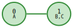

collapse allowed

</td><td width="50%" align="center">

**Mono: reject** — B and C map to same node (not injective)

</td></tr>
</table>

</details>

<details><summary><b>Complexity</b></summary>

| Morphism | Complexity | Why |
|----------|-----------|-----|
| Iso | GI-complete | Own complexity class, believed sub-exponential |
| SubIso | NP-complete | Generalizes clique, Hamiltonian path |
| EpiMono | GI-complete | Bijection check + edge preservation |
| Mono | NP-complete | Generalizes clique |
| Epi | NP-complete | Surjectivity + edge preservation |
| Homo | NP-complete | Generalizes graph coloring |

In practice, real-world graphs have structure (bounded degree, sparsity, value predicates) that makes these tractable with backtracking and pruning. Small patterns on large graphs are fast.

</details>

## Acknowledgement

Claude (Anthropic) has been involved in the implementation of this project since February 2026, contributing to code generation, cross-validation testing, and performance tuning.

The theoretical foundations (morphism cluster mixing, ban/get pattern semantics) are original human work rooted in 2014 PhD studies. The Rust DSL operator design and API architecture are new work built on top of that theory.

## License

Licensed under either of

- [Apache License, Version 2.0](LICENSE-APACHE)
- [MIT License](LICENSE-MIT)

at your option.
