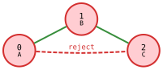

# Morphism Cheat Sheet

## Visual Examples

Pattern: path **A — B — C** (3 nodes, 2 edges). Target: triangle **0 — 1 — 2 — 0** (3 nodes, 3 edges).

### Mapping: A→0, B→1, C→2

The required edges (A—B, B—C) are present in the target. But there's an **extra edge 0—2** that the pattern doesn't mention.

*Mono: **accept** — extra edge is fine*

*SubIso: **reject** — extra edge violates induced constraint*

| Morphism | Verdict | Why |
|----------|---------|-----|
| **Iso** | reject | extra edge 0—2 not in pattern (induced violation) |
| **SubIso** | reject | same — induced: extra edge 0—2 |
| **EpiMono** | accept | bijective, edges preserved, extra OK |
| **Mono** | accept | injective, edges preserved, extra OK |
| **Epi** | accept | surjective, edges preserved |
| **Homo** | accept | edges preserved, no other constraints |

### Collapsing: A→0, B→1, C→1

C maps to the same target node as B — a **collapse**.

*Homo: **accept** — collapse allowed*

| Morphism | Verdict | Why |
|----------|---------|-----|
| **Mono** | reject | B and C map to same node (not injective) |
| **Homo** | accept | collapse allowed, edge A—B preserved |

### Surjectivity: pattern A—B on target 0—1—2

A two-node pattern on a three-node target. Node 2 is left uncovered.

| Morphism | Verdict | Why |
|----------|---------|-----|
| **Epi** | reject | node 2 not covered (surjectivity violated) |
| **Mono** | accept | uncovered nodes are fine |

## Quick Decision Guide

**Do I need each pattern node to match a different target node?**
- **Yes** → injective (Iso, SubIso, EpiMono, Mono)
- **No** → non-injective (Epi, Homo)

**Do I need every target node to be matched?**
- **Yes** → surjective (Iso, EpiMono, Epi)
- **No** → non-surjective (SubIso, Mono, Homo)

**Do I care about extra edges between matched nodes?**
- **Yes, reject them** → induced (Iso, SubIso)
- **No, allow them** → non-induced (EpiMono, Mono, Epi, Homo)

## Complexity

| Morphism | Complexity | Why |
|----------|-----------|-----|
| Iso | GI-complete | Own complexity class, believed sub-exponential |
| SubIso | NP-complete | Generalizes clique, Hamiltonian path |
| EpiMono | GI-complete | Bijection check + edge preservation |
| Mono | NP-complete | Generalizes clique |
| Epi | NP-complete | Surjectivity + edge preservation |
| Homo | NP-complete | Generalizes graph coloring |

In practice, real-world graphs have structure (bounded degree, sparsity, value predicates) that makes these tractable with backtracking and pruning. Small patterns on large graphs are fast.
