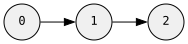
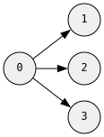
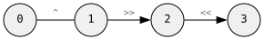
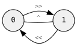

# `graph!` — Construction

The `graph!` macro constructs a graph from a declarative description of nodes and edges.

## DSL Primitives

| Symbol | Meaning |
|--------|---------|
| `N(id)` | New node with explicit local id |
| `N_()` | New node with auto-assigned id |
| `n(id)` | Reference to previously defined node |
| `E()` | Edge constructor (for attaching values) |
| `.val(v)` | Attach a value to a node or edge |
| `^` | Undirected edge |
| `>>` | Directed edge (source → target) |
| `<<` | Directed edge (target ← source) |
| `&` | Attach explicit edge value before direction operator |
| `,` | Separate independent fragments |

## Operator Precedence

The edge operators (`^`, `>>`, `<<`) are **left-associative** in Rust. This has an important consequence:

- **Flat chaining** `N(0) ^ N(1) ^ N(2)` creates a **star** — all edges radiate from node 0
- **Grouping** `N(0) ^ (N(1) ^ N(2))` creates a **path** — 0 connects to 1, 1 connects to 2

This is because `N(0) ^ N(1)` returns node 0 (with an edge to 1 attached), so the next `^ N(2)` adds another edge from 0.

## Undirected Graphs

### Path (grouping)

```rust
use grw::graph::{self, Graph, edge};

// path: 0 — 1 — 2
let g: Graph<(), edge::Undir<()>> = graph![
    N(0) ^ (N(1) ^ N(2))
].unwrap();
```


### Triangle (back-reference)

```rust
// triangle: chain + n() closes the cycle
let g: Graph<(), edge::Undir<()>> = graph![
    N(0) ^ (N(1) ^ (N(2) ^ n(0)))
].unwrap();
```


### Star (flat chaining)

```rust
// star: flat chaining fans out from one node
let g: Graph<(), edge::Undir<()>> = graph![
    N(0) ^ N(1)
         ^ N(2)
         ^ N(3)
         ^ N(4)
].unwrap();
```


### With Values

```rust
// node values
let g: Graph<&str, edge::Undir<()>> = graph![
    N(0).val("alice") ^ (N(1).val("bob") ^ N(2).val("carol"))
].unwrap();

// edge values — & E().val(...) before direction operator
let g: Graph<(), edge::Undir<f64>> = graph![
    N(0) & E().val(1.5) ^ (N(1) & E().val(2.0) ^ N(2))
].unwrap();

// both
let g: Graph<&str, edge::Undir<u32>> = graph![
    N(0).val("a") & E().val(10) ^ N(1).val("b")
].unwrap();
```

### Anonymous Nodes

```rust
// ids assigned automatically
let g: Graph<(), edge::Undir<()>> = graph![N_() ^ N_() ^ N_()].unwrap();
```

## Directed Graphs

```rust
// path: 0 → 1 → 2
let g: Graph<(), edge::Dir<()>> = graph![
    N(0) >> (N(1) >> N(2))
].unwrap();
```


```rust
// fan-out: flat chaining from one node
let g: Graph<(), edge::Dir<()>> = graph![
    N(0) >> N(1)
         >> N(2)
         >> N(3)
].unwrap();
```


```rust
// bidirectional: n() references existing nodes
let g: Graph<(), edge::Dir<()>> = graph![
    N(0) >> N(1),
    n(1) >> n(0),
].unwrap();
```


```rust
// incoming edges with <<
let g: Graph<(), edge::Dir<()>> = graph![
    N(0) << N(1),   // edge from 1 to 0
].unwrap();
```

## Anydirected Graphs

Mix undirected and directed edges in one graph:

```rust
let g: Graph<(), edge::Anydir<()>> = graph![
    N(0) ^ (N(1) >> N(2)),  // 0 — 1 → 2
    N(3) << n(2),            // 2 → 3
].unwrap();
```


```rust
// all three edge types between one pair
let g: Graph<(), edge::Anydir<()>> = graph![
    N(0) ^ N(1),         // undirected
    n(0) >> n(1),        // directed 0 → 1
    n(1) >> n(0),        // directed 1 → 0
].unwrap();
```


## Turbofish Syntax

When the type can't be inferred, use the turbofish form:

```rust
let g = graph![<(), grw::graph::edge::Undir<()>>; N(0) ^ N(1)].unwrap();
```

## Multiple Fragments

Use commas to separate disconnected components or back-references:

```rust
// two separate edges, then connect them
let g: Graph<(), edge::Undir<()>> = graph![
    N(0) ^ N(1),
    N(2) ^ N(3),
    n(0) ^ n(2),
].unwrap();
```
