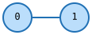
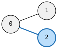
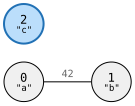
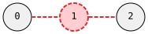
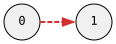
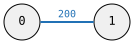

# `modify!` — Mutation

`modify!` applies transactional changes to an existing graph — adding nodes, removing nodes, adding/removing edges, and swapping values — all atomically. It returns a `Modification` describing everything that changed.

## DSL Primitives

| Symbol | Meaning |
|--------|---------|
| `N(id)` | New node (local id for back-references within this modification) |
| `N_()` | New node (auto-assigned local id) |
| `n(id)` | Reference to new node defined earlier in same `modify!` |
| `X(id)` | Existing graph node (by graph node id) |
| `x(id)` | Reference to existing graph node (no value change) |
| `!X(id)` | Remove existing node (and all its edges) |
| `E()` | New edge constructor |
| `e()` | Existing edge reference (for value swap) |
| `!e()` | Remove existing edge |
| `.val(v)` | Set value on node or edge |

## Adding Nodes and Edges

```rust
use grw::graph::{self, Graph, edge};

let mut g: Graph<(), edge::Undir<()>> = Graph::default();

// add two connected nodes
modify!(g, [N(1) ^ N(2)]).unwrap();
assert_eq!(g.node_count(), 2);
assert_eq!(g.edge_count(), 1);
```


```rust
// connect new node to existing
modify!(g, [X(0) ^ N(3)]).unwrap();
assert_eq!(g.node_count(), 3);
assert_eq!(g.edge_count(), 2);
```


```rust
let mut g: Graph<(), edge::Dir<()>> = Graph::default();

// directed path
modify!(g, [N(1) >> (N(2) >> N(3))]).unwrap();
assert_eq!(g.node_count(), 3);
assert_eq!(g.edge_count(), 2);
```


```rust
let mut g: Graph<(), edge::Undir<()>> = Graph::default();

// triangle via back-reference
modify!(g, [N(1) ^ (N(2) ^ (N(3) ^ n(1)))]).unwrap();
assert_eq!(g.node_count(), 3);
assert_eq!(g.edge_count(), 3);
```


### With Values

```rust
let mut g: Graph<&str, edge::Undir<u32>> = Graph::default();

// node and edge values
modify!(g, [
    N(1).val("a") & E().val(42u32) ^ N(2).val("b")
]).unwrap();
assert_eq!(g.node_count(), 2);
assert_eq!(g.edge_count(), 1);
```


```rust
// isolated node
modify!(g, [N(3).val("c")]).unwrap();
assert_eq!(g.node_count(), 3);
```


## Removing Nodes and Edges

```rust
let mut g: Graph<(), edge::Undir<()>> = Graph::default();
modify!(g, [N(1) ^ N(2) ^ N(3)]).unwrap();

// remove node 1 (and its edges)
modify!(g, [!X(1)]).unwrap();
assert_eq!(g.node_count(), 2);
```


```rust
let mut g: Graph<(), edge::Dir<()>> = Graph::default();
modify!(g, [N(1) >> N(2)]).unwrap();

// remove edge, keep both nodes
modify!(g, [X(0) & !e() >> x(1)]).unwrap();
assert_eq!(g.node_count(), 2);
assert_eq!(g.edge_count(), 0);
```


## Updating Values

```rust
let mut g: Graph<&str, edge::Undir<()>> = Graph::default();
modify!(g, [N(1).val("old")]).unwrap();
assert_eq!(g.get(0), Some(&"old"));

// swap node value
modify!(g, [X(0).val("new")]).unwrap();
assert_eq!(g.get(0), Some(&"new"));
```


```rust
let mut g: Graph<(), edge::Undir<u32>> = Graph::default();
modify!(g, [N(1) & E().val(100u32) ^ N(2)]).unwrap();

// swap edge value
modify!(g, [X(0) & e().val(200u32) ^ X(1)]).unwrap();
```


## Modification Result

The returned `Modification` struct contains:

- **`new_node_ids`** — mapping from local ids to real graph ids
- **`added_edges`** — edges that were created
- **`removed_nodes`** / **`removed_edges`** — what was deleted
- **`swapped_node_vals`** / **`swapped_edge_vals`** — old values that were replaced

```rust
let mut g: Graph<(), edge::Undir<()>> = Graph::default();
let result = modify!(g, [N(1) ^ N(2)]).unwrap();

// the local id 1 was assigned a real graph node id
let real_id = result.new_node_ids[&LocalId(1)];
```

## Color Legend for Diagrams

Throughout this documentation:
- <span style="color:#2171b5">**Blue**</span> — added or changed elements
- <span style="color:#d32f2f">**Red dashed**</span> — removed elements
- **Black** — existing, unchanged elements
