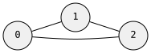

# `search!` — Pattern Matching

`search!` compiles a pattern into a query and iterates over all morphism-valid mappings from pattern nodes to target graph nodes. Patterns are organized into **clusters** — `get` (required) and `ban` (forbidden substructures).

 

## DSL Primitives

| Symbol | Meaning |
|--------|---------|
| `get(morphism) { ... }` | Required pattern cluster — must be found |
| `ban(morphism) { ... }` | Forbidden pattern cluster — matches are rejected |
| `N(id)` | Pattern node |
| `n(id)` | Reference to pattern node |
| `^` `>>` `<<` | Edge operators (same as `graph!`) |
| `!N(id)` | Negated node — the edge must NOT exist |
| `N(id).val(v)` | Node value — exact match |
| `N(id).test(\|v\| ...)` | Node value predicate |
| `E().val(v)` | Edge value — exact match |
| `X(id)` | Context node — pinned to a specific graph node |

## Basic Usage

When `search!` receives a graph reference, it creates a `Session` that you iterate with a `for` loop:

```rust
use grw::*;
use grw::graph::edge;

// target graph: triangle
let g: graph::Undir0 = graph![
    N(0) ^ (N(1) ^ (N(2) ^ n(0)))
].unwrap();

// search for edges
let session = search![&g,
    get(Mono) {
        N(0) ^ N(1)
    }
].unwrap();

for m in &session {
    let a = m.get(0).unwrap();
    let b = m.get(1).unwrap();
    println!("{:?} — {:?}", a, b);
}
```

## The Match Struct

Each iteration yields a `Match` — a mapping from pattern node local ids to graph node ids.

```rust
for m in &session {
    // get a specific pattern node's graph mapping
    let node_id: id::N = m.get(0).unwrap();

    // iterate all (pattern_local_id, graph_node_id) pairs
    for &(lid, nid) in m.iter() {
        println!("pattern {} → graph {:?}", lid.0, nid);
    }

    // just the graph node ids
    let graph_nodes: Vec<id::N> = m.values().collect();
}
```

### TranslatedMatch

For richer access to node values and adjacencies, use `translate()`:

```rust
for m in &session {
    let tm = session.translate(&m);

    // node with its value
    if let Some((nid, val)) = tm.node(0) {
        println!("pattern 0 → graph {:?} val={:?}", nid, val);
    }

    // all matched nodes with values
    for (lid, nid, val) in tm.nodes() {
        println!("{} → {:?} = {:?}", lid.0, nid, val);
    }
}
```

## Ban Clusters

Ban clusters define **forbidden substructures**. If the ban pattern matches, the overall match is rejected.

```rust
// find edges whose endpoints do NOT share a common neighbor
let session = search![&g,
    get(Mono) {
        N(0) ^ N(1)
    },
    ban(Mono) {
        n(0) ^ N(2),
        n(1) ^ n(2),
    }
].unwrap();
```

The `n(0)` and `n(1)` in the `ban` cluster refer back to the nodes defined in the `get` cluster. The ban says: "reject this match if nodes 0 and 1 share a common neighbor (node 2)."

## Sequential vs Parallel

The `Session` supports two iteration modes:

```rust
// sequential — lazy iterator, one match at a time
for m in session.iter() { /* ... */ }

// also works via IntoIterator
for m in &session { /* ... */ }

// parallel — uses rayon, collects all matches
let all: Vec<Match> = session.par_iter().collect();
```

**`session.iter()`** is single-threaded lazy backtracking — yields one match at a time. Use this when you want to process matches as a stream or stop early.

**`session.par_iter()`** partitions the search space across threads via rayon. Use this for large graphs where you need all matches and have cores to spare.

## Value Predicates

Filter matches based on node or edge values:

```rust
// find nodes where x > 10.0
let session = search![&g,
    get(Mono) {
        N(0).test(|p: &Point| p.x > 10.0) ^ N(1)
    }
].unwrap();
```

## Context Nodes

Pin a pattern node to a specific graph node:

```rust
// find all neighbors of graph node 5
let session = search![&g,
    get(Mono) {
        X(5) ^ N(0)
    }
].unwrap();
```

`X(5)` is pinned to graph node 5 — the search only looks for nodes connected to it.
